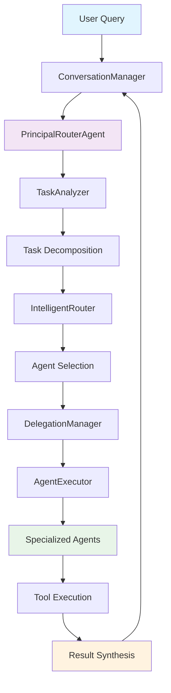

# Multi-Agent System with HoneyHive Tracing

This project demonstrates how to integrate **HoneyHive tracing** with a **multi-agent framework** (CrewAI) to build observable, evaluable AI systems. It showcases advanced orchestration patterns including LLM-powered task decomposition, intelligent agent routing, and nested delegation with comprehensive tracing.

## 🎯 Overview

This multi-agent system implements a agentic web query system that can:

- **Decompose complex queries** into subtasks using LLM analysis
- **Route tasks intelligently** to specialized agents based on capabilities
- **Delegate between agents** when expertise requirements change
- **Trace all operations** for observability and evaluation
- **Support multi-turn conversations** with context management

### Key Features

- ✅ **LLM-powered task analysis** and decomposition
- ✅ **Dynamic agent selection** based on capability matching
- ✅ **Nested delegation patterns** with automatic routing
- ✅ **Comprehensive HoneyHive tracing** at every level
- ✅ **Multi-turn conversation support** with memory
- ✅ **Rich tool ecosystem** integration
- ✅ **Automated evaluation** with HoneyHive datasets

## 🏗️ Code Architecture

### File Structure

```
Multi-agent/
├── README.md                 # This documentation
├── config.py                 # HoneyHive and system configuration
├── registry.py               # Data models, tools, and registries
├── agents.py                 # Specialized agent implementations
├── orchestration.py          # Task analysis, routing, and delegation logic
├── main.py                   # Conversation management and main workflow
└── evaluation.py             # HoneyHive evaluation setup
```

### Architecture Overview



### Component Breakdown

#### 1. **config.py** - Configuration Management
- HoneyHive connection settings
- System-wide configuration parameters
- Environment-specific settings

#### 2. **registry.py** - Core Data Models & Tools
- **Data Models**: `SubTask`, `TaskDecomposition`, `ConversationContext`, etc.
- **Tool Registry**: Centralized tool definitions and implementations
- **Type Definitions**: Enums and utility classes

#### 3. **agents.py** - Specialized Agent Pool
- **BaseSpecializedAgent**: Common agent functionality
- **Agent Implementations**: Research, Data Analysis, Financial, Technical, Creative, Legal
- **Capability Scoring**: Automatic agent-task matching
- **CrewAI Integration**: Task execution with proper tool binding

#### 4. **orchestration.py** - Intelligence Layer
- **TaskAnalyzer**: LLM-powered query decomposition
- **IntelligentRouter**: Agent selection and execution planning
- **DelegationManager**: Nested delegation decision-making
- **AgentExecutor**: Coordinated task execution with tracing

#### 5. **main.py** - Conversation & Workflow Management
- **ConversationManager**: Multi-turn conversation handling
- **Session Management**: Context persistence and retrieval
- **Main Workflow**: End-to-end query processing

#### 6. **evaluation.py** - HoneyHive Evaluation
- **Evaluation Dataset**: Pre-defined test scenarios
- **Evaluation Function**: HoneyHive-compatible evaluation wrapper
- **Metrics Collection**: Automated performance assessment

## 🔍 HoneyHive Integration Deep Dive

### Essential Imports

```python
# Core HoneyHive imports
from honeyhive.tracer import HoneyHiveTracer
from honeyhive.tracer.custom import trace
from honeyhive import evaluate

# Initialize tracing (once per application) in the main conversation workflow at the start of a session
HoneyHiveTracer.init(**HONEYHIVE_CONFIG)
```

### Tracing Strategy

#### 1. **Core Workflow Function-Level Tracing**
Place `@trace()` decorators on all significant functions that need to be debugged or improved:

```python
@trace()
def orchestrate_multi_agent_workflow(self, query: str, context: Optional[ConversationContext] = None):
    """Main orchestration with full tracing"""
    # Implementation traces automatically
```

#### 2. **Agent Class Method-Level Tracing**
Each agent's key execution method is traced:

```python
@trace()
def execute_research_specialist(self, task: SubTask) -> str:
    """Traces individual agent execution"""
    return self._run_crew_task(task)
```

### Tracing Best Practices

#### ✅ **DO**: Strategic Placement
- **Entry points**: Main workflow functions
- **Decision points**: LLM calls, agent selection, delegation
- **Execution boundaries**: Individual agent tasks
- **Integration points**: Tool usage, external API calls

#### ✅ **DO**: Meaningful Naming
- Use descriptive function names that appear in traces
- Group related functionality in classes
- Maintain consistent naming conventions

#### ❌ **DON'T**: Over-trace
- Avoid tracing simple utility functions
- Don't trace internal implementation details
- Skip tracing pure data transformation functions

## 🧪 Evaluation Setup

### Evaluation Function Structure

Create an evaluation function that follows HoneyHive's expected pattern:

```python
def main(inputs, ground_truths=None):
    """
    HoneyHive evaluation function that:
    1. Extracts query from inputs
    2. Processes through multi-agent system
    3. Returns structured results for evaluation
    """
    query = inputs.get("query") or inputs.get("task")
    result = run_single_query_eval(query, session_id)
    
    return {
        "response": result["response"],
        "subtasks_count": len(result["decomposition"].subtasks),
        "agents_used": list(set(r["agent"] for r in result["task_results"].values())),
        # ... additional metrics
    }
```

### Dataset Design

Dynamically or statically generate comprehensive test scenarios covering different complexity levels:

```python
def create_evaluation_dataset():
    return [
        {
            "inputs": {"query": "Analyze financial performance..."},
            "ground_truths": {
                "expected_agents": ["financial_advisor", "data_analyst"],
                "task_complexity": "high"
            }
        },
        # ... more scenarios
    ]
```

### Evaluation Execution

Pass the dataset and execution function as arguments to the `evaluate` utility to log an experiment.

```python
evaluate(
    function=main,
    api_key=HONEYHIVE_CONFIG['api_key'],
    project=HONEYHIVE_CONFIG['project'],
    name='Multi-Agent System Eval',
    dataset=dataset,
    evaluators=[],  # Server-side evaluation
    server_url=HONEYHIVE_CONFIG['server_url']
)
```

## 🚀 Getting Started

### Prerequisites

```bash
pip install crewai openai honeyhive
```

### Environment Setup

Set the following environment variables:

```bash
# Required
export HONEYHIVE_API_KEY="your_api_key_here"
export OPENAI_API_KEY="your_openai_key_here"
export SERPAPI_KEY="your_serpapi_key_here"

# Optional (with defaults)
export HONEYHIVE_PROJECT="Multi Agent"
export HONEYHIVE_SOURCE="dev"
export HONEYHIVE_SESSION_NAME="Multi-Agent Trace"
export HONEYHIVE_SERVER_URL="https://api.honeyhive.ai"
```

**Security Note**: All sensitive configuration values have been moved to environment variables. Never commit API keys or secrets to version control.

### Running the System

#### Interactive Mode (Demo)
```bash
python main.py
```

#### Evaluation Mode
```bash
python evaluation.py
```

### Example Queries

The system handles complex multi-domain queries like:

- **Financial Analysis**: "Analyze Commonwealth Bank's performance over the last 5 years"
- **Technical Design**: "Design a mobile banking app with real-time fraud detection"
- **Legal Research**: "Research AI regulations in Australia for banking technology"
- **Creative Content**: "Create a marketing campaign for sustainable investment products"

## 📊 Monitoring & Observability

### Trace Hierarchy

HoneyHive captures the complete execution hierarchy:

```
process_single_query
├── orchestrate_multi_agent_workflow
│   ├── decompose_user_query (TaskAnalyzer)
│   ├── create_execution_plan (IntelligentRouter)
│   ├── coordinate_agent_execution (AgentExecutor)
│   │   ├── evaluate_delegation_need (DelegationManager)
│   │   └── execute_research_specialist (Agent)
│   └── synthesize_results (PrincipalRouterAgent)
└── add_turn (ConversationManager)
```

### Key Metrics

For sake of keeping the code simple, we have implemented LLM evaluators server-side on the key workflow functions.

If you already have metric code in your codebase, you can utilize `enrich_span` to add that context on the key functions.

