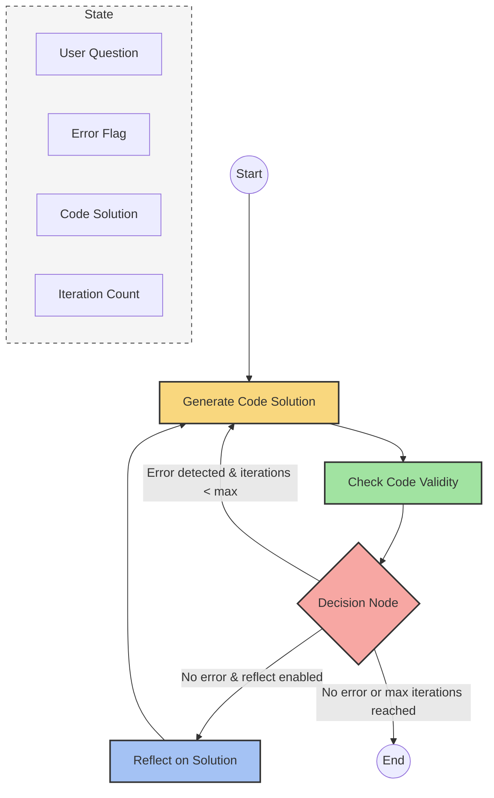

# LangGraph Cookbook: Code Generation with RAG and Self-Correction

This repository demonstrates how to implement a code generation system with Retrieval-Augmented Generation (RAG) and self-correction capabilities using LangGraph, integrated with HoneyHive for tracing and monitoring.

## Overview

The system generates code solutions based on user questions about LangChain Expression Language (LCEL) or HoneyHive integration by:

1. Retrieving relevant documentation
2. Generating a structured code solution
3. Validating the solution for syntax errors
4. Self-correcting when errors are detected
5. Tracing the entire process with HoneyHive

## Features

- **Retrieval-Augmented Generation**: Uses documentation to provide context-aware code generation
- **Structured Output**: Generates solutions with a clear prefix, imports, and code blocks
- **Error Detection & Self-Correction**: Validates code and auto-corrects when issues are found
- **Process Tracing**: Integrates HoneyHive for comprehensive tracing and monitoring
- **Maximum Iteration Control**: Limits correction attempts to prevent infinite loops

## Prerequisites

- Python 3.10+
- Access to OpenAI and Anthropic APIs
- HoneyHive account

## Installation

```bash
pip install -r requirements.txt
```

## Environment Setup

Set the following environment variables:

```bash
export HONEYHIVE_API_KEY="your_honeyhive_api_key"
export HONEYHIVE_PROJECT="langgraph-tracer"
export HONEYHIVE_SOURCE="development"
export OPENAI_API_KEY="your_openai_api_key"
export ANTHROPIC_API_KEY="your_anthropic_api_key"
```

## Usage

Run the main script with a question:

```bash
python main.py
```

This will execute the default example: "How can I use HoneyHive tracing with LangGraph?"

To customize, modify the question in the `__main__` block of `main.py`.

## Example Output

The output will include:
- A prefix describing the solution
- Required imports
- Executable code that implements the solution

## Architecture

The system uses a LangGraph workflow with the following nodes:
- `generate`: Creates a code solution based on the question and documentation
- `code_check`: Validates imports and code syntax
- `reflect`: Optionally reviews the solution before finishing
- Decision node to determine whether to regenerate, reflect, or finish

### Workflow Diagram



## Acknowledgments

- [LangChain](https://python.langchain.com/)
- [LangGraph](https://github.com/langchain-ai/langgraph)
- [HoneyHive](https://docs.honeyhive.ai/)
- [Anthropic Claude](https://www.anthropic.com/) 