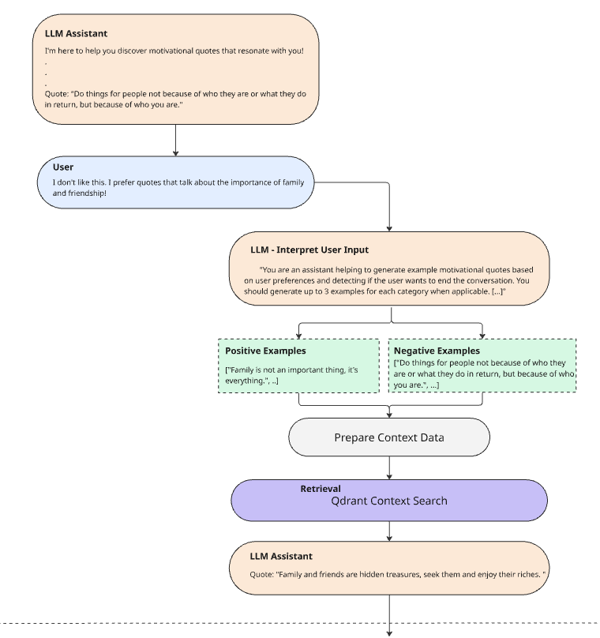
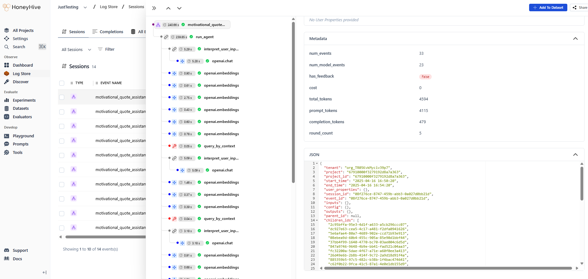
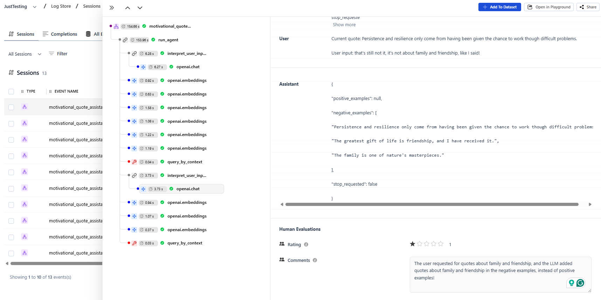

# Motivational Quote Discovery Agent

This project implements a simple conversational agent that helps users discover motivational quotes they resonate with. It leverages Qdrant for efficient vector search and OpenAI's language models for generating embeddings and understanding user preferences through conversation.

For this project, we'll use a small dataset of 1000 inspirational quotes taken from Kaggle's [Inspirational Quotes Dataset](https://www.kaggle.com/datasets/mattimansha/inspirational-quotes).



## Features

*   **Conversational Interaction:** Users provide feedback on quotes, and the agent adapts its recommendations.
*   **Vector Search:** Uses Qdrant to find semantically similar quotes based on user feedback (positive and negative examples).
*   **LLM Integration:** Utilizes OpenAI's `gpt-4` to interpret natural language feedback and `text-embedding-3-small` for creating quote embeddings.
*   **Data Preparation:** Includes a script to process a CSV file (`inspiration.csv`), generate embeddings, and populate the Qdrant collection.
*   **Observability:** Integrated with HoneyHive for tracing and session enrichment.

## Prerequisites

*   Python 3.8+
*   Docker and Docker Compose (for running Qdrant)
*   An OpenAI API Key
*   A HoneyHive API Key and Project Name for tracing

## Setup

1.  **Clone the repository:**
    ```bash
    git clone <your-repo-url>
    cd <repository-directory>
    ```

2.  **Create a Python virtual environment:**
    ```bash
    python -m venv .venv
    source .venv/bin/activate  # On Windows use `.venv\Scripts\activate`
    ```

3.  **Install dependencies:**
    ```bash
    pip install -r requirements.txt
    ```

4.  **Set up environment variables:**
    Create a file named `.env` in the project root directory and add the following, replacing the placeholder values:
    ```dotenv
    OPENAI_API_KEY="<your-openai-api-key>"
    # Optional: For HoneyHive Tracing
    # HH_API_KEY="<your-honeyhive-api-key>"
    # HH_PROJECT="<your-project-name>"
    # Optional: Customize Qdrant collection name
    # COLLECTION_NAME="custom_quotes_collection"
    ```
    *   `COLLECTION_NAME` defaults to `quotes_collection` if not set.

## Running the Application

1.  **Start Qdrant:**
    Run the Qdrant vector database using Docker. This command mounts a local directory (`./qdrant_storage`) for persistent storage.
    ```bash
    docker run -p 6333:6333 -p 6334:6334 \
        -v "$(pwd)/qdrant_storage:/qdrant/storage:z" \
        qdrant/qdrant
    ```
    Wait a few moments for Qdrant to initialize.

2.  **Prepare Data and Create Collection:**
    Run the script to process the `inspiration.csv` file (make sure it exists in the root directory), generate embeddings (or load from `quotes_with_embeddings.parquet` if it exists), and create/populate the Qdrant collection.
    ```bash
    python create_collection.py
    ```
    *Note: This script currently limits the upsert to the first 1000 quotes defined by `MAX_DATAPOINTS` in the script. Adjust if needed.*
    *The first run will generate embeddings and save them to `quotes_with_embeddings.parquet`. Subsequent runs will load from this file.*

3.  **Run the Conversational Agent:**
    Start the main application.
    ```bash
    python app.py
    ```
    The agent will present quotes, and you can provide feedback like "I like this", "No, not that", "Give me something about resilience", or type "stop" to end the session.

## How it Works

1.  **Initialization:** The `create_collection.py` script reads quotes from `inspiration.csv`, generates vector embeddings using OpenAI's API, and stores them in a Qdrant collection defined by `COLLECTION_NAME`.
2.  **Conversation:** The `app.py` script starts the agent.
    *   It presents an initial random quote.
    *   The user provides feedback.
    *   `interpret_user_input_with_llm` uses `gpt-4` to parse the feedback, identifying positive/negative sentiment or specific preferences, potentially generating example quotes based on the input, and checking for a "stop" command.
    *   Embeddings are generated for any positive/negative examples derived from the user's feedback.
    *   These embeddings are used to form `ContextPair` objects for Qdrant.
    *   `query_by_context` in `retrieve.py` searches Qdrant using these context pairs to find quotes similar to the positive examples and dissimilar to the negative ones, excluding previously seen quotes.
    *   A new quote is presented, and the loop continues until the user types "stop".
3.  **Tracing:** Provide HoneyHive credentials in the `.env` file to trace interactions with the LLM and key agent functions using the `honeyhive` library.

## Viewing the dashboard

After running the application and interacting with it, we can visualize the entire session flow within HoneyHive. Each session trace provides a hierarchical view of the operations performed, including our custom traced functions (`run_agent`, `interpret_user_input_with_llm`, `query_by_context`) and automatically traced events like LLM calls (for generating examples) and embedding generations.



This detailed tracing enables powerful analysis and debugging workflows:

- **Analyzing Interaction Length:** How many rounds does it typically take for a user to find a quote they like? Are users genuinely finding good recommendations, or are they abandoning the session after numerous unsuccessful attempts? By logging the `round_count` metadata, we can filter sessions based on the number of rounds (`filter->metadata->round_count`). Examining sessions with very high or very low round counts can reveal whether users are engaged and successful or frustrated and giving up.
- **Root Cause Analysis:** When a user receives unsatisfying recommendations, the traces help identify the source of the problem. Was it an LLM misinterpretation of the user's feedback? Did the Qdrant retrieval step fail to return relevant results despite accurate context? Or perhaps the user interacted with the application in an unexpected way? Tracing each component allows us to pinpoint bottlenecks and areas for improvement.
- **Identifying and Annotating Issues:** No system is perfect, and our quote assistant will inevitably encounter edge cases or make mistakes. For instance, the LLM might misinterpret feedback, leading to incorrect positive or negative examples (as shown below, where the LLM incorrectly flagged family/friendship quotes as negative despite the user's preference). HoneyHive allows us to annotate these problematic events directly within the trace, adding comments and ratings. This human feedback is invaluable for targeted improvements and can be easily surfaced later by filtering for annotated traces.


