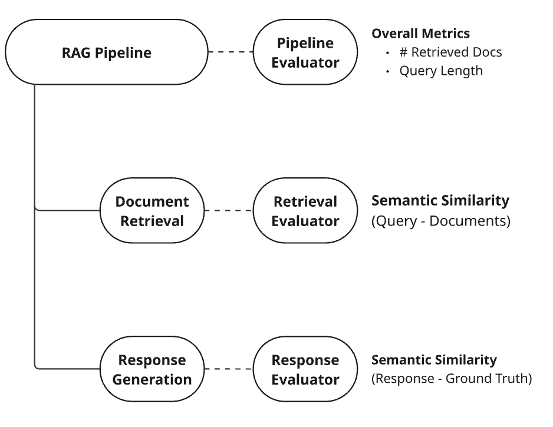
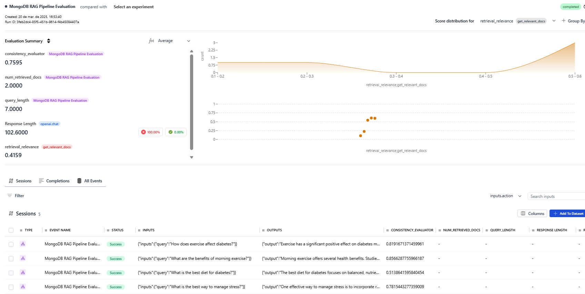
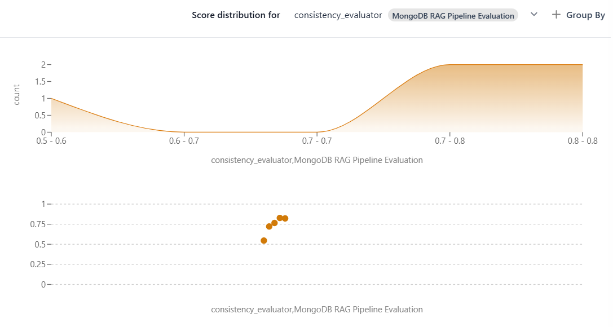
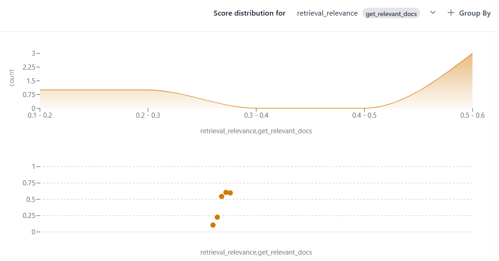

# Evaluating Complex LLM Workflows: Why Component-Level Metrics Are Essential

Sophisticated Large Language Model (**LLM**) applications often involve intricate, multi-step workflows. Systems like Retrieval-Augmented Generation (RAG), agentic workflows, or chained API calls depend on multiple components working together seamlessly to deliver a final result.

However, this complexity introduces unique evaluation challenges. Evaluating only the final output can obscure critical insights into how individual steps contribute to the overall performance. Key challenges include:

- **Identifying Bottlenecks**: Pinpointing which specific step causes poor overall performance.
- **Hidden Intermediate Errors**: Masking underlying flaws in earlier steps that could cause failures in different scenarios.
- **Error Propagation**: Compounding mistakes from early stages, degrading final quality.
- **Interdependencies**: Assessing individual component performance when they rely heavily on previous steps' outputs.

To build reliable and scalable AI systems, it's essential to evaluate not just the final output but also the intermediate steps. This project demonstrates how to implement component-level metrics using a practical **RAG** pipeline example involving **MongoDB**, **OpenAI**, and **HoneyHive** for evaluation.

## Component-Level Evaluation with HoneyHive

Addressing the challenges of multi-step workflow evaluation requires tools designed for such intricacies. HoneyHive provides the necessary framework by capturing detailed traces of your application's execution. Each trace breaks down the workflow into individual **spans**, representing specific operations like LLM calls, function executions, or tool usage.

This granular view is key to understanding component performance. HoneyHive allows you to attach custom metrics and metadata at different levels:

*   **Span-Level Metrics (`enrich_span`):** Calculate and log metrics specific to a single step (span). For instance, in a RAG pipeline, log `retrieval_relevance` within the retrieval span or `answer_faithfulness` within the generation span. This isolates performance measurement to the exact point of execution, helping identify bottlenecks or errors within specific components.
*   **Session-Level Metrics (`enrich_session`):** Log metrics summarizing the entire end-to-end execution or relating to the interaction as a whole (e.g., overall latency, total tokens, final output quality).

This flexible approach enables defining evaluators for the final output while simultaneously capturing performance indicators for every intermediate step. You gain both a high-level view and the deep, component-specific insights needed for effective debugging and optimization, directly tackling the challenges outlined above.

## Case Study: Evaluating a RAG Pipeline Step-by-Step

Let's illustrate component-level evaluation with a practical example: a Retrieval-Augmented Generation (RAG) pipeline designed for medical/health question answering using MongoDB Atlas for vector search and OpenAI's API for generation.

We'll demonstrate evaluation using an [offline experiment with HoneyHive's `evaluate` function](https://docs.honeyhive.ai/evaluation/introduction), which involves:
1.  Defining a curated **dataset** (queries, ground truth answers).
2.  Running the RAG **application logic** against each dataset entry.
3.  Using **evaluators** to compute metrics for individual components (retrieval, generation) and the overall pipeline output.

This systematic approach helps track metrics and compare performance across different configurations.

### RAG Pipeline Components

The pipeline consists of:

- **Document Retrieval**: Uses MongoDB vector search to find relevant documents for a query.
- **Response Generation**: Uses OpenAI's API to generate an answer based on the query and retrieved documents.

### Evaluators Used

- **Retrieval Evaluator**: Assesses retrieval relevance (semantic similarity between query and retrieved documents).
- **Response Evaluator**: Measures response consistency (semantic similarity between the generated response and ground truth).
- **Pipeline Evaluator**: Captures general metrics (e.g., number of retrieved documents, query length).

<Frame caption="Overview of the RAG Pipeline and Evaluation Points">
  
</Frame>

## Running the Example

Follow these steps to run the RAG pipeline evaluation experiment.

### Prerequisites

This guide assumes you have:
1. A MongoDB Atlas cluster set up.
2. A database named `medical_db` with a collection named `articles`.
3. A vector search index named `vector_index` on the `articles` collection with this configuration:
   ```json
   {
     "fields": [
       {
         "numDimensions": 384,
         "path": "embedding",
         "similarity": "cosine",
         "type": "vector"
       }
     ]
   }
   ```
If you haven't set up these prerequisites, refer to [MongoDB Atlas documentation](https://www.mongodb.com/docs/atlas/getting-started/), or adapt the setup for your own vector DB or retrieval system.

### Setup

1.  **Install dependencies:**
    ```bash
    pip install -r requirements.txt
    ```

2.  **Configure environment variables:** Create a `.env` file in the root directory with your API keys and settings:
    ```dotenv
    OPENAI_API_KEY=<your-openai-key>
    HH_API_KEY=<your-honeyhive-api-key>
    HH_PROJECT=<your-honeyhive-project-name>
    MONGODB_URI=<your-mongodb-uri>
    ```

### Execution

Run the evaluation script:
```bash
python rag_eval.py
```

## Analyzing Results in HoneyHive

After the script finishes, navigate to the Experiments page in your HoneyHive project to view the results.

<Frame caption="The Experiments Dashboard in HoneyHive">
  
</Frame>

In this example, the dashboard highlights potential issues:

*   Some queries show low `retrieval_relevance`.
*   The average `response_consistency` (0.73) is significantly higher than the average `retrieval_relevance` (0.41).

Let's examine the distribution of these metrics:

<Frame caption="Response Consistency Distribution">
  
</Frame>

<Frame caption="Retrieval Relevance Distribution">
  
</Frame>

The discrepancy suggests the generation model produces relevant-sounding answers, but they might not be well-grounded in the retrieved context, especially when retrieval relevance is low (e.g., below 0.25).

Drilling down into a specific data point with low retrieval relevance confirms this:

<Frame caption="Example of Low Retrieval Relevance Data Point">
  
</Frame>

The retrieved documents are clearly irrelevant to the query. This pinpoints the retrieval system as the area needing improvement. Further investigation might reveal insufficient documents in the vector database on certain topics (like stress and sleep disorders in this case), explaining the poor retrieval performance.

This component-level analysis, facilitated by HoneyHive's detailed tracing and metrics, allows for targeted debugging and optimization of the RAG pipeline.
