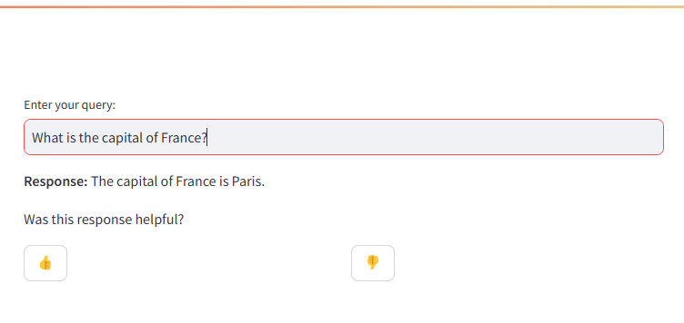

# HoneyHive Streamlit Integration Cookbook

This repository demonstrates how to instrument a Streamlit application with HoneyHive to track model calls and collect user feedback on AI responses.

## Overview

This cookbook shows you how to:
- Create a simple chat interface using Streamlit
- Integrate HoneyHive tracing to log model calls
- Collect and track user feedback on responses
- Manage session state for user interactions

## Prerequisites

- Python 3.7+
- OpenAI API key
- HoneyHive API key and project setup

## Installation

1. Clone this repository
2. Install the required dependencies:

```bash
pip install -r requirements.txt
```

3. Create a `.env` file in the root directory with the following variables:

```
OPENAI_API_KEY=your_openai_api_key
HONEYHIVE_API_KEY=your_honeyhive_api_key
HONEYHIVE_PROJECT=your_project_name
HONEYHIVE_SERVER_URL=https://api.staging.honeyhive.ai
```

## Running the Application

To run the Streamlit app:

```bash
streamlit run app.py
```

This will start a local web server and open the application in your browser:




## How It Works

### HoneyHive Integration

The application uses HoneyHive to trace model calls and collect feedback:

1. **Initialization**: HoneyHive tracer is initialized at the start of the session
```python
tracer = HoneyHiveTracer.init(
    api_key=os.getenv('HONEYHIVE_API_KEY'),
    project=os.getenv('HONEYHIVE_PROJECT'),
    session_name="Streamlit Session",
    server_url=os.getenv('HONEYHIVE_SERVER_URL')
)
```

2. **Tracing Model Calls**: When generating responses using the OpenAI API, the session ID is captured for tracking

3. **Feedback Collection**: User feedback (👍 or 👎) is captured and associated with the specific model response
```python
def handle_feedback(feedback, session_id):
    enrich_session(feedback={"helpful": feedback}, session_id=session_id)
```

### Application Flow

1. User enters a query in the text input field
2. The app generates a response using OpenAI's GPT-3.5 Turbo
3. The response is displayed along with feedback buttons
4. User feedback is captured and sent to HoneyHive for tracking


## Key Takeaways

This cookbook demonstrates:
- How to add observability to AI-powered applications
- Methods for collecting user feedback in Streamlit
- Session management techniques for tracking interactions
- Integrating HoneyHive for LLM monitoring and evaluation

## Further Resources

- [HoneyHive Documentation](https://docs.honeyhive.ai/)
- [Streamlit Documentation](https://docs.streamlit.io/)
- [OpenAI API Documentation](https://platform.openai.com/docs/api-reference)

