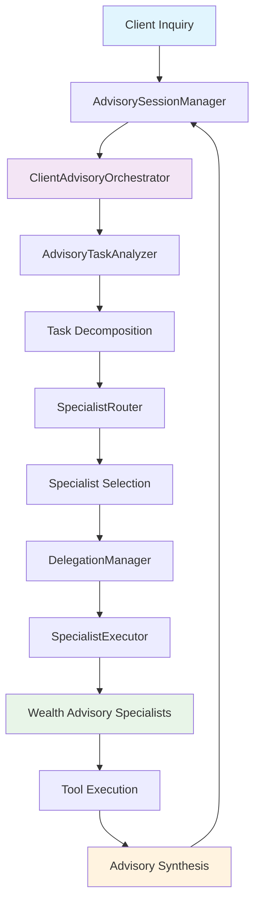

# Wealth Management Multi-Agent System with HoneyHive Tracing

This project demonstrates how to integrate **HoneyHive tracing** with a **multi-agent framework** (CrewAI) to build observable, evaluable AI systems for **wealth management and client advisory** use cases. It showcases advanced orchestration patterns including LLM-powered task decomposition, intelligent specialist routing, and nested delegation with comprehensive tracing.

## 🎯 Overview

This multi-agent system implements a wealth advisory platform that can:

- **Analyze client inquiries** and decompose them into specialist tasks using LLM analysis
- **Route tasks intelligently** to wealth management specialists based on capabilities
- **Delegate between specialists** when expertise requirements change
- **Trace all operations** for observability and evaluation
- **Support multi-turn conversations** with client context management

### Key Features

- ✅ **LLM-powered advisory task analysis** and decomposition
- ✅ **Dynamic specialist selection** based on capability matching
- ✅ **Nested delegation patterns** with automatic routing
- ✅ **Comprehensive HoneyHive tracing** at every level
- ✅ **Multi-turn conversation support** with memory
- ✅ **Wealth management tool ecosystem** integration
- ✅ **Automated evaluation** with HoneyHive datasets

## 🏗️ Code Architecture

### File Structure

```
wealth-management-agent/
├── README.md                 # This documentation
├── requirements.txt          # Python dependencies
├── .env.example              # Example environment variables (copy to .env)
├── config.py                 # HoneyHive and system configuration
├── registry.py               # Data models, tools, and registries
├── agents.py                 # Wealth advisory specialist implementations
├── orchestration.py          # Task analysis, routing, and delegation logic
├── main.py                   # Session management and main workflow
└── evaluation.py             # HoneyHive evaluation setup
```

### Architecture Overview



### Component Breakdown

#### 1. **config.py** - Configuration Management
- HoneyHive connection settings (from environment variables)
- System-wide configuration parameters
- Environment-specific settings

#### 2. **registry.py** - Core Data Models & Tools
- **Data Models**: `SubTask`, `TaskDecomposition`, `ConversationContext`, etc.
- **Tool Registry**: Wealth management tool definitions and implementations
  - `market_data_search` - Market research and financial news
  - `client_portfolio_query` - Client holdings and account data
  - `portfolio_analytics` - Risk metrics and performance attribution
  - `financial_calculator` - Projections and scenario analysis
  - `policy_document_retriever` - Investment policies and compliance docs
- **Type Definitions**: Task types for wealth advisory workflows

#### 3. **agents.py** - Wealth Advisory Specialist Pool
- **BaseSpecializedAgent**: Common agent functionality
- **Specialist Implementations**:
  - **MarketIntelligenceAnalyst**: Market research, economic analysis, sector trends
  - **QuantitativeAnalyst**: Portfolio optimization, risk modeling, performance attribution
  - **WealthStrategist**: Asset allocation, retirement planning, tax optimization
  - **FintechSolutionsArchitect**: Digital banking, platform capabilities
  - **ClientCommunicationsSpecialist**: Client reports, proposals, personalized content
  - **RegulatoryComplianceOfficer**: Suitability review, KYC, fiduciary compliance
- **Capability Scoring**: Automatic specialist-task matching
- **CrewAI Integration**: Task execution with proper tool binding

#### 4. **orchestration.py** - Intelligence Layer
- **AdvisoryTaskAnalyzer**: LLM-powered client inquiry decomposition
- **SpecialistRouter**: Specialist selection and execution planning
- **DelegationManager**: Nested delegation decision-making
- **SpecialistExecutor**: Coordinated task execution with tracing
- **ClientAdvisoryOrchestrator**: Main workflow coordination

#### 5. **main.py** - Session & Workflow Management
- **AdvisorySessionManager**: Multi-turn conversation handling
- **Session Management**: Context persistence and retrieval
- **Main Workflow**: End-to-end client inquiry processing

#### 6. **evaluation.py** - HoneyHive Evaluation
- **Evaluation Dataset**: Pre-defined wealth advisory test scenarios
- **Evaluation Function**: HoneyHive-compatible evaluation wrapper
- **Metrics Collection**: Automated performance assessment

## 🔍 HoneyHive Integration Deep Dive

### Essential Imports

```python
# Core HoneyHive imports
from honeyhive.tracer import HoneyHiveTracer
from honeyhive.tracer.custom import trace
from honeyhive import evaluate

# Initialize tracing (once per application) in the main workflow
HoneyHiveTracer.init(**HONEYHIVE_CONFIG)
```

### Tracing Strategy

#### 1. **Core Workflow Function-Level Tracing**
Place `@trace()` decorators on all significant functions:

```python
@trace()
def orchestrate_advisory_workflow(self, query: str, context: Optional[ConversationContext] = None):
    """Main orchestration with full tracing"""
    # Implementation traces automatically
```

#### 2. **Specialist Method-Level Tracing**
Each specialist's execution method is traced:

```python
@trace()
def execute_wealth_strategist(self, task: SubTask) -> str:
    """Traces individual specialist execution"""
    return self._run_crew_task(task)
```

### Tracing Best Practices

#### ✅ **DO**: Strategic Placement
- **Entry points**: Main workflow functions
- **Decision points**: LLM calls, specialist selection, delegation
- **Execution boundaries**: Individual specialist tasks
- **Integration points**: Tool usage, external API calls

#### ✅ **DO**: Meaningful Naming
- Use descriptive function names that appear in traces
- Group related functionality in classes
- Maintain consistent naming conventions

#### ❌ **DON'T**: Over-trace
- Avoid tracing simple utility functions
- Don't trace internal implementation details
- Skip tracing pure data transformation functions

## 🧪 Evaluation Setup

### Evaluation Function Structure

Create an evaluation function that follows HoneyHive's expected pattern:

```python
def main(inputs, ground_truths=None):
    """
    HoneyHive evaluation function that:
    1. Extracts client inquiry from inputs
    2. Processes through wealth advisory system
    3. Returns structured results for evaluation
    """
    query = inputs.get("query") or inputs.get("task")
    result = run_single_advisory_eval(query, session_id)
    
    return {
        "response": result["response"],
        "subtasks_count": len(result["decomposition"].subtasks),
        "agents_used": list(set(r["agent"] for r in result["task_results"].values())),
        # ... additional metrics
    }
```

### Dataset Design

Comprehensive test scenarios covering different wealth advisory use cases:

```python
def create_evaluation_dataset():
    return [
        {
            "inputs": {"query": "Review portfolio and recommend rebalancing for retirement..."},
            "ground_truths": {
                "expected_agents": ["quantitative_analyst", "wealth_strategist"],
                "scenario_type": "portfolio_review"
            }
        },
        # ... more scenarios
    ]
```

### Evaluation Execution

```python
evaluate(
    function=main,
    api_key=HONEYHIVE_CONFIG['api_key'],
    project=HONEYHIVE_CONFIG['project'],
    name='Wealth Advisory Platform Eval',
    dataset=dataset,
    evaluators=[],  # Server-side evaluation
    server_url=HONEYHIVE_CONFIG['server_url']
)
```

## 🚀 Getting Started

### Prerequisites

- Python 3.8+
- API keys: [HoneyHive](https://honeyhive.ai), [OpenAI](https://platform.openai.com), [SerpAPI](https://serpapi.com) (for market data search)

### Installation

1. **Clone the cookbook** (or navigate to this directory):
   ```bash
   git clone https://github.com/honeyhiveai/cookbook.git
   cd cookbook/wealth-management-agent
   ```

2. **Create a virtual environment** (recommended):
   ```bash
   python -m venv venv
   source venv/bin/activate   # On Windows: venv\Scripts\activate
   ```

3. **Install dependencies**:
   ```bash
   pip install -r requirements.txt
   ```

### Environment Setup

Set the following environment variables before running the cookbook. You can copy `.env.example` to `.env` and fill in your keys (ensure `.env` is not committed).

```bash
# Required
export HONEYHIVE_API_KEY="your_api_key_here"
export OPENAI_API_KEY="your_openai_key_here"
export SERPAPI_KEY="your_serpapi_key_here"

# Optional (with defaults)
export HONEYHIVE_PROJECT="Wealth Advisory Platform"
export HONEYHIVE_SOURCE="dev"
export HONEYHIVE_SESSION_NAME="Client Advisory Trace"
export HONEYHIVE_SERVER_URL="https://api.honeyhive.ai"
```

**Security Note**: All sensitive configuration values must be provided via environment variables. Never commit API keys or secrets to version control.

### Running the System

#### Interactive Mode (Demo)
```bash
python main.py
```
Type your client inquiries at the prompt; type `exit` to end the session.

#### Evaluation Mode
```bash
python evaluation.py
```
Runs the pre-defined evaluation scenarios and logs results to HoneyHive.

### Example Client Inquiries

The system handles complex wealth management inquiries like:

- **Portfolio Review**: "Review the Smith family portfolio and recommend rebalancing given their upcoming retirement in 5 years"
- **Market Analysis**: "Analyze the impact of rising interest rates on our clients' fixed income allocations"
- **Investment Recommendation**: "Recommend suitable ESG-focused investment options for a risk-averse HNW client"
- **Compliance Check**: "Verify suitability of concentrated stock position for a moderate-risk client profile"
- **Client Communication**: "Draft a quarterly investment review letter for clients affected by recent market volatility"

## 📊 Monitoring & Observability

### Trace Hierarchy

HoneyHive captures the complete execution hierarchy:

```
process_client_inquiry
├── orchestrate_advisory_workflow
│   ├── analyze_client_inquiry (AdvisoryTaskAnalyzer)
│   ├── create_advisory_execution_plan (SpecialistRouter)
│   ├── coordinate_specialist_execution (SpecialistExecutor)
│   │   ├── evaluate_delegation_need (DelegationManager)
│   │   └── execute_wealth_strategist (Specialist)
│   └── synthesize_advisory_response (ClientAdvisoryOrchestrator)
└── add_turn (AdvisorySessionManager)
```

### Key Metrics

For simplicity, LLM evaluators are implemented server-side on the key workflow functions.

If you have metric code in your codebase, you can utilize `enrich_span` to add that context on the key functions.

## Wealth Advisory Specialist Capabilities

| Specialist | Key Capabilities |
|-----------|-----------------|
| Market Intelligence Analyst | market_research, economic_analysis, sector_analysis, competitor_intelligence |
| Quantitative Analyst | portfolio_optimization, risk_modeling, performance_attribution, stress_testing |
| Wealth Strategist | asset_allocation, retirement_planning, tax_optimization, estate_planning |
| FinTech Solutions Architect | digital_onboarding, api_integration, platform_capabilities, automation_design |
| Client Communications Specialist | proposal_writing, client_reporting, personalized_content, presentation_design |
| Regulatory Compliance Officer | suitability_review, kyc_verification, regulatory_research, fiduciary_compliance |
